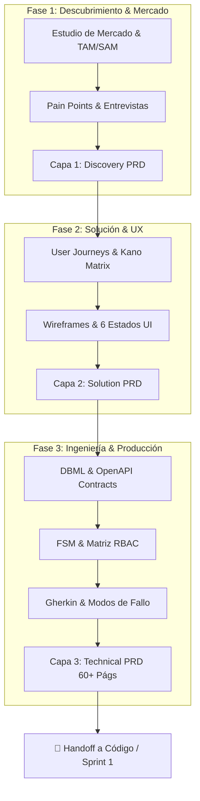
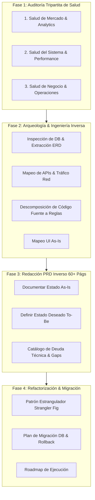
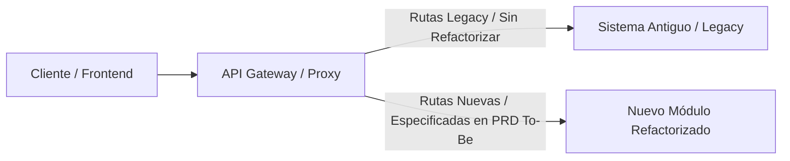

# MASTER PRD Methodology

Seleccionar: Data

# 📚 Masterplan Metodológico: Sistema Dual de PRDs de Ultra-Precisión

Este documento establece la metodología completa para la concepción, especificación y evolución de productos de software mediante **PRDs de Ultra-Precisión (60+ páginas)**. Se divide en dos vertientes operativas:

1. **Parte A: Proyecto Desde Cero (Greenfield)** - Desarrollo progresivo desde la idea y estudio de mercado hasta la entrega a ingeniería.
2. **Parte B: Proyecto En Curso (Brownfield)** - Auditoría tripartita de salud, investigación de mercado actualizada, ingeniería inversa y migración segura.

---

# 🟢 PARTE A: METODOLOGÍA PARA PROYECTO DESDE CERO (GREENFIELD)

---

## FASE 1: Descubrimiento y Validación de Mercado (Capa 1 PRD: 3-5 Páginas)

### Paso 1.1: Formulación del Problema y Oportunidad

- **Declaración del Problema:** ¿Quién sufre el problema, con qué frecuencia y cuál es el impacto financiero/operacional de no resolverlo?
- **Cuantificación de Mercado (TAM / SAM / SOM):**
    - *TAM (Total Addressable Market):* Tamaño total de la oportunidad global.
    - *SAM (Serviceable Addressable Market):* Segmento al que podemos llegar con la tecnología/recursos actuales.
    - *SOM (Serviceable Obtainable Market):* Cuota de mercado objetivo en los primeros 12-18 meses.

### Paso 1.2: Investigación Cuantitativa y Cualitativa

- **Benchmarking Competitivo (Matriz Paridad/Diferenciación):**
    - Mapeo de los 5 competidores directos e indirectos.
    - Análisis de precios, modelos de monetización y quejas recurrentes de sus usuarios (reseñas en G2, Capterra, App Store).
- **Entrevistas a Usuarios (Jobs-To-Be-Done):**
    - Mínimo 15 a 20 entrevistas estructuradas para validar las alternativas actuales que usa el usuario.
- **Disposición a Pagar (*Willingness to Pay*):**
    - Encuestas Van Westendorp de sensibilidad de precios para definir rangos de monetización.

### Paso 1.3: Cierre de Capa 1 y Gate Check #1

- **Resultado en el PRD:** Se redactan las primeras 3 a 5 páginas con la justificación del negocio, las métricas de éxito (KPIs/OKRs) y los hallazgos del mercado.
- **Gate Check 1 (Go / No-Go):** Si el estudio muestra mercado insuficiente o nula disposición a pagar, el proyecto se cancela o pivota con cero costo de código gastado.

---

## FASE 2: Arquitectura de Producto y UX (Capa 2 PRD: 15-25 Páginas)

### Paso 2.1: Modelado de Usuarios y Funcionalidades

- **User Personas & Customer Journeys:** Definición detallada de los roles de usuario y sus flujos de navegación ideales.
- **Matriz de Priorización (Kano / MoSCoW):**
    - *Must-Have:* Requisitos esenciales para el lanzamiento.
    - *Should-Have:* Funcionalidades importantes para la versión 1.1.
    - *Could-Have / Delighters:* Diferenciadores para capturar mercado.
    - *Won’t-Have:* Out of Scope explícito para la versión 1.0.

### Paso 2.2: Diseño de Interfaces y Matriz de Estados de UI

- **Wireframing & Prototype Mapping:** Diseño de pantallas clave.
- **Matriz de los 6 Estados de UI:** Especificación obligatoria para cada pantalla:
    1. *Default State:* Vista con datos normales.
    2. *Loading State:* Shimmer / Skeletons.
    3. *Empty State:* Ilustración y llamada a la acción cuando no hay datos.
    4. *Error State:* Manejo visual de fallas de red o servidor.
    5. *Partial State:* Carga progresiva o paginación.
    6. *Disabled State:* Estado inactivo por falta de permisos o validación.

### Paso 2.3: Cierre de Capa 2 y Gate Check #2

- **Resultado en el PRD:** El documento alcanza entre 15 y 25 páginas. Incluye la arquitectura de información, la matriz de pantallas y las historias de usuario de alto nivel.

---

## FASE 3: Especificación de Ingeniería y Producción (Capa 3 PRD: 60+ Páginas)

Aquí es donde el PRD se convierte en un documento técnico de precisión absoluta.

### Paso 3.1: Diccionario de Datos y Modelo DBML

- Definición de esquemas de base de datos SQL/NoSQL en sintaxis DBML.
- Claves primarias, foráneas, índices, restricciones de unicidad y valores por defecto.

### Paso 3.2: Contratos de API (OpenAPI 3.0 / DTOs)

- Definición de endpoints HTTP, métodos (`GET`, `POST`, `PUT`, `DELETE`, `PATCH`).
- Envio de cabeceras (`Authorization`, `Idempotency-Key`).
- Esquemas JSON de Request Payload y Response Payloads para todos los códigos HTTP (`200`, `400`, `401`, `403`, `404`, `409`, `422`, `500`).

### Paso 3.3: Máquinas de Estados Finitas (FSM)

- Diagramación de todos los estados de entidades críticas (ej. Orden, Usuario, Suscripción).
- Definición de transiciones permitidas, disparadores (*triggers*) y efectos secundarios (*side-effects*).

### Paso 3.4: Seguridad, Permisos (RBAC) y Eventos

- **Matriz RBAC:** Permisos por rol a nivel de recurso y campo (*Field-Level Access*).
- **Esquema de Eventos:** Especificación de mensajes asíncronos para el Bus de Eventos (Kafka, RabbitMQ, Redis PubSub) y Webhooks de salida.

### Paso 3.5: Historias de Usuario Gherkin & Matriz de Modos de Fallo

- Redacción de escenarios `Given-When-Then` para desarrollo y pruebas QA.
- **Matriz de Fallos:** Estrategias para *race conditions*, fallas de proveedores terceros (Stripe, Twilio), desconexiones y latencia.

### Paso 3.6: Requisitos No Funcionales (NFRs)

- Latencias objetivo (P95/P99), SLAs de uptime (99.9%), cumplimiento (GDPR, PCI-DSS), política de respaldos y cifrado.

### Paso 3.7: Handoff a Desarrollo

- El PRD de 60+ páginas se aprueba y se entrega al equipo de ingeniería. Los desarrolladores pueden codificar sin hacer preguntas ambiguas durante todo el ciclo de desarrollo.

---

# 🔴 PARTE B: METODOLOGÍA PARA PROYECTO EN CURSO / INGENIERÍA INVERSA (BROWNFIELD)

Esta metodología se aplica cuando el software ya existe, fue parcialmente construido, está en producción con problemas o carece de documentación.

---

## FASE 1: Auditoría Tripartita de Salud y Re-Validación de Mercado

Antes de tocar el código o redefinir el producto, se realiza un diagnóstico en 3 dimensiones:

### Pilar 1: Auditoría de Salud de Mercado y Producto Activo

- **Analítica de Uso Real:** Revisión de Amplitude/Google Analytics para identificar embudos de conversión, puntos de fuga (*drop-off*) y pantallas jamás utilizadas.
- **Auditoría de UX & Mapas de Calor:** Análisis de mapas de calor y grabaciones de sesión (Hotjar, Microsoft Clarity) para detectar puntos de frustración (*rage clicks*, *dead clicks*).
- **Entrevistas de Churn y Salida:** Entrevistar a usuarios que abandonaron la plataforma para identificar fallas estructurales.
- **Re-Validación de Mercado:** Verificar si la propuesta de valor inicial sigue vigente o si los competidores han ganado ventaja.

### Pilar 2: Auditoría de Salud del Sistema y Código (*Tech Health*)

- **Core Web Vitals & Rendimiento:** Medición de LCP, FID, CLS, TTFB y latencia P95/P99 en API endpoints.
- **Análisis de Logs de Error:** Inspección de Sentry/Datadog para contabilizar excepciones no controladas en producción.
- **Auditoría de Deuda Técnica y Cobertura:** Porcentaje de cobertura de pruebas unitarias/E2E, paquetes desactualizados, librerías deprecadas y vulnerabilidades de seguridad (Snyk/npm audit).
- **Auditoría de SEO y Accesibilidad:** Evaluación Lighthouse/Semrush para posicionamiento y cumplimiento WCAG 2.1.

### Pilar 3: Auditoría de Salud de Negocio y Finanzas

- **Cloud FinOps:** Inspección de costos de servidores (AWS/GCP/Vercel) para identificar recursos sobredimensionados o consultas ineficientes que encarecen la infraestructura.
- **Métricas Unitarias:** Verificación de CAC vs. LTV real.

---

## FASE 2: Arqueología del Sistema e Ingeniería Inversa Estructurada

Extraer la verdad inmutable contenida en la base de datos y el código fuente.

### Paso 2.1: Ingeniería Inversa de Base de Datos

- **Dump & Inspection:** Ejecutar scripts de inspección de esquema (`pg_dump --schema-only` o introspección Prisma/TypeORM).
- **Generación de ERD Actual:** Renderizar el Modelo Entidad-Relación real del sistema mediante herramientas como DBeaver o SchemaSpy.
- **Auditoría de Integridad:** Detectar campos huérfanos, falta de índices en claves foráneas o campos guardados con tipos incorrectos (ej. guardar fechas como texto).

### Paso 2.2: Ingeniería Inversa de APIs y Tráfico de Red

- **Captura de Tráfico:** Inspección de red con Charles Proxy, Fiddler o DevTools.
- **Generación de Colección OpenAPI/Postman:** Mapear todos los endpoints activos, sus parámetros requeridos y las respuestas JSON reales que emiten.

### Paso 2.3: Deconstrucción del Código Fuente a Reglas de Negocio

- Traducir sentencias `if/else`, validaciones de formulario, hooks y middlewares a **Reglas de Negocio en español plano**.
- Mapear las dependencias ocultas entre módulos (ej. *“El módulo de facturación llama internamente al servicio de inventario mediante una consulta directa sin evento”*).

---

## FASE 3: Elaboración del PRD Inverso (As-Is vs. To-Be / 60+ Páginas)

Se construye la fuente de verdad integrando lo descubierto en la Fase 1 y Fase 2.

### Estructura de Módulos para el PRD Inverso:

1. **Estado Actual (*As-Is*):** Documentación matemática y precisa de cómo funciona el sistema hoy en día (con sus defectos y virtudes).
2. **Estado Deseado (*To-Be*):** Especificación de los cambios requeridos basados en la auditoría de salud y el nuevo estudio de mercado.
3. **Matriz de Gap Analysis (Brechas):**

| Módulo | Comportamiento Actual (*As-Is*) | Problema Identificado (Auditoría) | Comportamiento Futuro (*To-Be*) | Prioridad |
| --- | --- | --- | --- | --- |
| **Autenticación** | Sesión mediante Cookies sin expiración. | Vulnerabilidad de seguridad crítica (OWASP #2). | Migración a JWT en HttpOnly Cookies con Refresh Tokens y expiración de 15 min. | **P0 (Inmediata)** |
| **Checkout** | Formulario de 8 pasos en 4 pantallas. | Abandono del 62% según Analytics; 4.2s de carga. | Checkout de 1 sola página (*Single Page Checkout*) con autocompletado y P95 < 500ms. | **P0 (Inmediata)** |
| **Reportes** | Consulta SQL directa sobre DB de producción. | Bloquea la base de datos para usuarios activos durante la generación del reporte. | Creación de Read Replica asíncrona o exportación vía background job en Redis Queue. | **P1 (Alta)** |
1. **Re-Especificación Completa:** Se redactan los 10 módulos de ultra-precisión (DBML renovado, OpenAPI contratos To-Be, Historias Gherkin, FSMs y NFRs).

---

## FASE 4: Plan de Refactorización y Estrategia de Migración Segura

No se puede detener el negocio para reescribir todo desde cero (el mito de la “Reescritura Total” suele terminar en fracaso). Se aplica una estrategia de evolución incremental.

### Paso 4.1: Aplicación del Patrón Estrangulador (*Strangler Fig Pattern*)

- El sistema legacy sigue operando.
- Los nuevos módulos o refactorizaciones especificadas en el PRD To-Be se construyen de forma aislada (microservicios o módulos independientes).
- Se coloca un API Gateway/Proxy que redirige el tráfico progresivamente del sistema legacy al nuevo sistema.

### Paso 4.2: Estrategia de Migración de Datos y Plan de Rollback

- **Migración de Doble Escritura (*Dual-Writing*):** Los nuevos eventos escriben en la DB legacy y en el nuevo esquema simultáneamente durante la transición.
- **Script de Backfill & Reconciliación:** Proceso de sincronización de datos históricos hacia el nuevo modelo especificado en el PRD.
- **Plan de Rollback Explicito:** Para cada módulo desplegado, el PRD especifica el procedimiento de reversión si la tasa de error supera el 1% en los primeros 15 minutos post-despliegue.

---

# 📌 Resumen de Aplicabilidad

- Para un **Proyecto Desde Cero (Greenfield)**: Avanzas progresivamente por las **Capas 1, 2 y 3 del PRD**. Validas el mercado antes de invertir en UX, y validas UX antes de redactar las 60+ páginas de ingeniería.
- Para un **Proyecto En Curso (Brownfield)**: Ejecutas la **Auditoría Tripartita (Mercado, Sistema, Finanzas)**, realizas **Ingeniería Inversa** del código/DB actual, redactas el **PRD Inverso (As-Is vs. To-Be)** y ejecutas la migración mediante el **Patrón Estrangulador**.