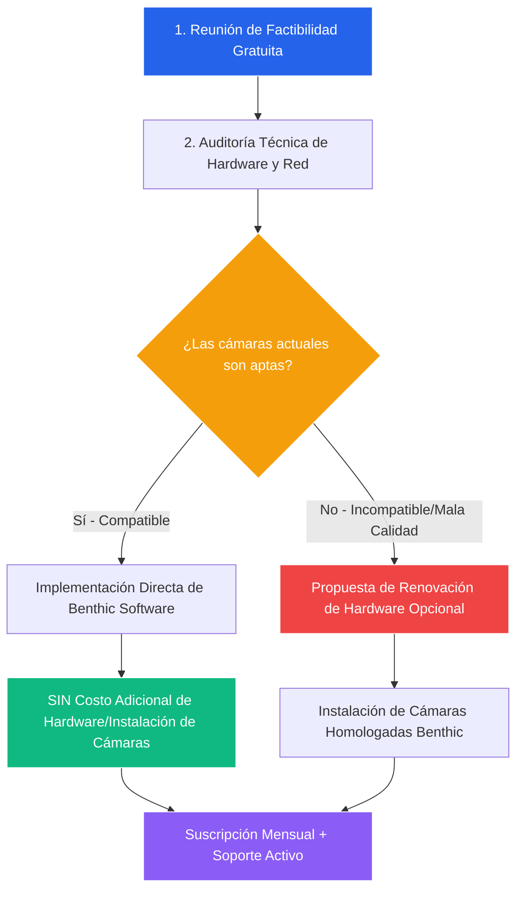
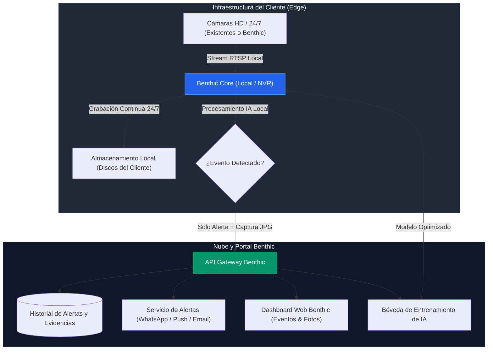

# Propuesta de Comercialización y Arquitectura: Benthic Security & Analytics

Este documento consolida la estrategia comercial, el flujo de ventas, los costos y la arquitectura técnica para la suite de seguridad y analítica de **Benthic**.

---

## 1. Modelo Comercial y Planes de Servicio

### 💳 **Suscripción Mensual de Software + Soporte Continuo**
- **Incluye:**
  - Licencia de uso del motor de IA y software de detección Benthic.
  - Acceso al Portal Cloud Benthic (Alertas, Historial de Capturas y Gestión).
  - Canales de notificación en tiempo real (WhatsApp, Email, App Push).
  - Entrenamiento y optimización continua de los modelos de IA según escenas del cliente.
  - Soporte técnico proactivo, actualizaciones de software y monitoreo de salud del sistema (Heartbeat).

---

## 2. Flujo de Adopción e Instalación

### 📋 **Etapas del Flujo:**

1. **Reunión de Factibilidad:**
   - Análisis de las necesidades de seguridad y zonas clave del cliente.
   - Determinación del alcance (cantidad de canales/cámaras y analíticas requeridas).

2. **Auditoría Técnica de Cámaras:**
   - Verificación de flujos RTSP, resolución, tasa de cuadros (FPS) y visibilidad nocturna.
   - Evaluación del estado del cableado e infraestructura de red existente.

3. **Escenario A — Hardware Existente Compatible ($0 Costo Adicional de Cámaras):**
   - Si la infraestructura actual cumple con los estándares, se despliega el software Benthic sobre su hardware actual.
   - El cliente solo paga la **suscripción mensual del software con soporte**.

4. **Escenario B — Instalación de Cámaras Homologadas (Costo Adicional Opcional):**
   - Si el hardware es obsoleto o de baja calidad, se presenta una cotización separada por la provisión e instalación de cámaras de alta fidelidad.
   - El cliente decide si adquiere el hardware con Benthic para asegurar la máxima precisión.

---

## 3. Arquitectura Híbrida del Sistema (Edge + Cloud)

---

## 4. Matriz Comercial de Preguntas Frecuentes (FAQ)

| Pregunta del Cliente | Respuesta de Benthic |
| :--- | :--- |
| **¿Tengo que comprar cámaras nuevas sí o sí?** | No. Primero realizamos una **reunión de factibilidad y auditoría sin costo**. Si tus cámaras actuales cumplen con nuestros estándares mínimos de resolución y fluidez, las integramos directamente sin cobrarte instalación de cámaras. |
| **¿Qué incluye la suscripción mensual?** | Incluye la licencia del software de analítica con IA, acceso al portal en la nube de alertas, notificaciones en tiempo real (WhatsApp/App), entrenamiento continuo de tus modelos y soporte técnico preventivo 24/7. |
| **¿Qué pasa si mis cámaras son de mala calidad?** | Te ofreceremos de manera opcional un paquete de hardware homologado con su costo de instalación transparente. Tienes la libertad de decidir si renovarlas con nosotros. |
| **¿Dónde se guardan mis videos?** | El video continuo de 24 horas se queda en tu empresa por privacidad. A la nube de Benthic solo viaja una captura JPG y la notificación cuando la IA detecta un evento relevante. |
